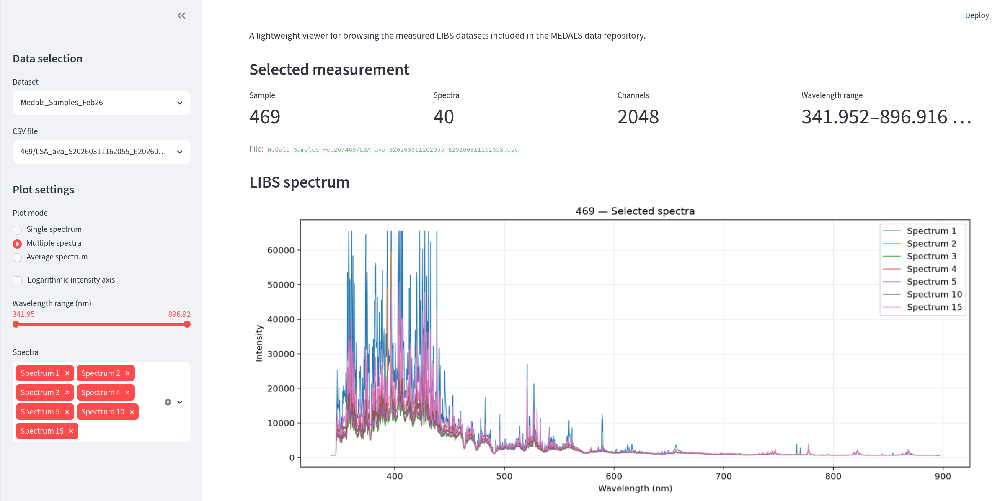

# MEDALS Measured Datasets

This repository contains measured Laser-Induced Breakdown Spectroscopy (LIBS) datasets collected within the Horizon Europe **MEDALS** project — *Metallic Elements Dissipation Avoided by Life cycle design for Steel* (Grant Agreement No. 101138516).

The repository accompanies **Deliverable D4.6 — MeasData: Open measured data set** and contains the measured spectral datasets made available to the University of Limerick (UL) during the project.

The repository is intentionally simple: the measured data are preserved in their dataset folders, this `README.md` provides the main documentation, and `viewer.py` provides a lightweight Streamlit interface for browsing and visualising the spectra.

---

## Repository Structure

```text
MEDALS-measured-datasets/
│
├── README.md
├── viewer.py
│
├── Medals_Samples_Feb26/
│   ├── 469/
│   ├── 470/
│   ├── 471/
│   ├── 472/
│   ├── 473/
│   ├── 551/
│   ├── 552/
│   ├── 553/
│   ├── 554/
│   ├── 555/
│   ├── 556/
│   ├── Al_ENAS-42000-1/
│   ├── M2-7_A3/
│   ├── SS405/
│   ├── SS465-1/
│   ├── SS467/
│   ├── Einstellungen.txt
│   ├── reference_compositions.json
│   └── *.jpeg
│
├── Medals_MovingSamples_2026-04-29/
│   ├── 15 spectral CSV files
│   └── 5 JPEG images
│
└── July2026_ScrapSamples/
    ├── ScrapSamples/
    │   └── 26 spectral CSV files
    └── SteelGrades/
        └── 7 spectral CSV files
```

The current repository contains **22 directories and 140 files**. The original dataset directory names and spectral filenames have been preserved.

---

# 1. Dataset Overview

Three main measured sub-datasets are included.

| Dataset | Samples / files | Spectra | Channels per spectrum | Wavelength range | Main characteristic |
|---|---:|---:|---:|---|---|
| `Medals_Samples_Feb26` | 16 sample IDs / 80 CSV files | 3,200 | 2,048 | 341.952–896.916 nm | Reference materials and additional labelled samples |
| `Medals_MovingSamples_2026-04-29` | 15 sample IDs / 15 CSV files | 79 | 2,048 | 341.952–896.916 nm | Measurements acquired under moving-sample conditions |
| `July2026_ScrapSamples` | 33 CSV files | 698 | 2,048 | 341.952–896.916 nm | Scrap samples and labelled industrial material grades |

All three sub-datasets use the same **2,048-channel wavelength grid**, so their spectral columns can be aligned directly by wavelength.

The datasets differ in sample organisation, number of spectra per sample, availability of reference composition information, and measurement conditions. These differences should be considered when comparing the datasets or using them for data analysis.

---

# 2. Reference Materials and Material Grades

The repository contains two main types of samples with known material information:

1. **BAS/BCS spectroscopic reference materials**, for which reference elemental compositions are available.
2. **European material grades**, for which published grade specifications are available but sample-specific certified compositions are not provided in the dataset.

## 2.1 BAS/BCS Reference Materials

The reference materials comprise ferritic stainless-steel standards `469–473` and phosphor-bronze standards `551–556`.

### BAS/BCS reference compositions

| Sample | Reference material | Matrix | Reference composition (wt.%) |
|---|---|---|---|
| 469 | Ferritic stainless steel | Fe-based | C 0.279; Si 0.421; Mn 0.598; P 0.015; S 0.020; Cr 11.93; Ni 0.246; Co 0.01*; Cu 0.02*; V 0.02* |
| 470 | Ferritic stainless steel | Fe-based | C 0.153; Si 0.335; Mn 0.235; P 0.024; S 0.035; Cr 17.68; Ni 0.369; Co 0.02*; Cu 0.02*; V 0.02* |
| 471 | Ferritic stainless steel | Fe-based | C 0.095; Si 0.326; Mn 0.417; P 0.018; S 0.023; Cr 23.85; Ni 0.960; Co 0.02*; Cu 0.02*; V 0.03* |
| 472 | Ferritic stainless steel | Fe-based | C 0.227; Si 1.050; Mn 1.020; P 0.032; S 0.029; Cr 15.82; Mo 0.661; Ni 1.950; Co 0.02*; Cu 0.02*; V 0.02* |
| 473 | Ferritic stainless steel | Fe-based | C 0.172; Si 0.604; Mn 0.494; P 0.019; S 0.030; Cr 9.06; Mo 0.950; Ni 0.060*; Co 0.01*; Cu 0.03*; V 0.02* |
| 551 | Phosphor bronze | Cu-based | Cu 87.4; Sn 8.92; P 1.01; Pb 0.79; Ni 0.76; Zn 0.74; Fe 0.20; Si 0.018; Al 0.052 |
| 552 | Phosphor bronze | Cu-based | Cu 87.7; Sn 9.78; P 0.77; Pb 0.63; Ni 0.56; Zn 0.35; Fe 0.10; Si 0.019; Al 0.023 |
| 553 | Phosphor bronze | Cu-based | Cu 87.0; Sn 10.8; P 0.68; Pb 0.47; Ni 0.44; Zn 0.49; Fe 0.056; Si 0.022; Al 0.017 |
| 554 | Phosphor bronze | Cu-based | Cu 87.4; Sn 11.3; P 0.41; Pb 0.34; Ni 0.22; Zn 0.22; Fe 0.022; Si 0.038; Al 0.005 |
| 555 | Phosphor bronze | Cu-based | Cu 87.1; Sn 12.1; P 0.18; Pb 0.24; Ni 0.11; Zn 0.16; Fe 0.010; Si 0.036; Al <0.005 |
| 556 | Phosphor bronze | Cu-based | Cu 86.4; Sn 13.2; P 0.10; Pb 0.16; Ni 0.014; Zn 0.09; Fe 0.004; Si <0.005; Al <0.005 |

**Notes**

- Values marked with `*` are approximate values reported by BAS and are not certified values.
- All other listed values are certified unless otherwise stated.
- For Fe-based reference materials, Fe represents the balance of the composition.
- For Cu-based reference materials, Cu represents the balance where appropriate.
- The file `Medals_Samples_Feb26/reference_compositions.json` contains the reference-composition metadata included with the dataset.
- Some original composition sources use qualifiers such as `<0.005`; these should not be interpreted as exact concentrations.

## 2.2 European Material Grades

The `SteelGrades` directory in `July2026_ScrapSamples` contains seven labelled European material grades.

The values below are **published grade specifications or nominal composition ranges**, not certified sample-specific concentrations.

| Material no. | Common designation | Material family | Published composition / specification (wt.%) |
|---|---|---|---|
| 1.4301 | 304 | Austenitic stainless steel | C ≤0.07; Cr 17.5–19.5; Ni 8.0–10.5; Mn ≤2.0; Si ≤1.0; N ≤0.10; Fe balance |
| 1.4404 | 316L | Austenitic stainless steel | C ≤0.03; Cr 16.5–18.5; Ni 10.0–13.0; Mo 2.0–3.0; Mn ≤2.0; Si ≤1.0; N ≤0.10; Fe balance |
| 1.4462 | 2205 Duplex | Duplex stainless steel | C ≤0.03; Cr 21.0–23.0; Ni 4.5–6.5; Mo 2.5–3.5; Mn ≤2.0; Si ≤1.0; N 0.10–0.22; Fe balance |
| 1.4539 | 904L | Highly alloyed austenitic stainless steel | C ≤0.02; Cr 19.0–21.0; Ni 24.0–26.0; Mo 4.0–5.0; Mn ≤2.0; Si ≤0.70; Cu 1.2–2.0; N ≤0.15; Fe balance |
| 1.3974 | X2CrNiMnMoNNb23-17-6-3 | Non-magnetic highly alloyed steel | C ≤0.03; Cr 21.0–24.5; Ni 15.5–18.0; Mo 2.8–3.4; Mn 4.5–6.5; Si ≤1.0; N 0.30–0.50; Nb 0.10–0.30; Fe balance |
| 1.4860 | NiCr 30 20 | High-alloy Ni–Cr material | Ni 30.0–32.0; Cr 19.5–21.5; Fe balance |
| 2.4605 | Alloy 59 / UNS N06059 | Nickel-based Ni–Cr–Mo alloy | C ≤0.01; Cr 22.0–24.0; Mo 15.0–16.5; Mn ≤0.5; Si ≤0.10; Fe ≤1.5; Cu ≤0.5; Co ≤0.3; Al 0.1–0.4; Ni balance |

**Important:** material `2.4605` is a nickel-based alloy rather than a steel grade.

---

# 3. Common CSV Structure

The spectral files are semicolon-separated CSV files.

A typical file has the following structure:

```text
MeasCtr;TimeStamp;341.952;342.246;342.54;...;896.916
0;...;...;...;...;...;...
1;...;...;...;...;...;...
```

The first two columns contain metadata:

- `MeasCtr` — measurement counter
- `TimeStamp` — integer acquisition timestamp

The remaining **2,048 columns** contain spectral intensity values, with wavelengths in nanometres used as column headers.

| Property | Specification |
|---|---|
| Separator | Semicolon (`;`) |
| Metadata columns | `MeasCtr`, `TimeStamp` |
| Spectral channels | 2,048 |
| Wavelength coverage | 341.952–896.916 nm |
| Wavelength ordering | Strictly increasing |
| Channel spacing | Nonuniform, approximately 0.242–0.294 nm |
| Mean channel spacing | Approximately 0.2711 nm |
| Intensity representation | Integer values |
| Physical intensity unit | Not documented |

The wavelength-channel spacing is a sampling property and should not be interpreted as the optical spectral resolution.

---

# 4. Sub-dataset 1 — `Medals_Samples_Feb26`

## 4.1 Overview

This sub-dataset contains LIBS measurements from **16 sample IDs** and **80 CSV files**, corresponding to **3,200 spectra**.

Each sample is represented by five CSV files, and each file contains 40 spectra. Therefore, each sample contributes 200 spectra.

Despite the directory name `Medals_Samples_Feb26`, the acquisition dates encoded in the CSV filenames correspond to **11 March 2026**.

## 4.2 General Specifications

| Property | Specification |
|---|---|
| Sample IDs | 16 |
| Measurement files per sample | 5 |
| Spectra per measurement file | 40 |
| Spectra per sample | 200 |
| Total spectral files | 80 CSV files |
| Total spectra | 3,200 |
| Wavelength channels per spectrum | 2,048 |
| Total intensity values | 6,553,600 |
| Supporting files | 1 composition JSON, 1 TXT file, 3 JPEG images |
| Directory size | Approximately 31.85 MiB |
| Acquisition date in filenames | 11 March 2026 |
| Filename time span | 16:20:55–16:47:45 |
| Timezone | Not specified |

## 4.3 Sample Inventory

| Sample ID(s) | Material / label information | Reference composition |
|---|---|---|
| 469–473 | Ferritic stainless-steel BAS/BCS reference materials | Available |
| 551–556 | Phosphor-bronze BAS/BCS reference materials | Available |
| `Al_ENAS-42000-1` | Aluminium-labelled sample | Not provided in this dataset |
| `M2-7_A3` | Sample label only | Not provided |
| `SS405` | Sample label only | Not provided |
| `SS465-1` | Sample label only | Not provided |
| `SS467` | Sample label only | Not provided |

The dataset is balanced by sample ID, with 200 spectra per sample.

These 16 IDs should not automatically be interpreted as 16 independently verified industrial grades.

## 4.4 CSV and Spectral Specifications

| Property | Specification |
|---|---|
| Header rows | 1 |
| Data rows per CSV | 40 |
| Columns per CSV | 2,050 |
| `MeasCtr` | Measurement counter, consistently 1–40 |
| `TimeStamp` | Integer acquisition timestamp; unit and reference origin undocumented |
| Wavelength coverage | 341.952–896.916 nm |
| Wavelength spacing | Nonuniform, approximately 0.242–0.294 nm |
| Mean wavelength spacing | Approximately 0.2711 nm |
| Intensity representation | Integer values |
| Observed intensity range | 496–65,535 |

## 4.5 Quality Checks

| Check | Result |
|---|---|
| Consistent file structure | All files contain 40 data rows and the same 2,048-channel wavelength grid |
| Missing / non-numeric intensities | None detected |
| Exact duplicate CSV files | None detected |
| Values equal to 65,535 | 1,641 |
| Spectra containing at least one 65,535 value | 492 of 3,200 (15.4%) |

Repeated values of `65,535` suggest possible saturation or clipping at some wavelengths.

---

# 5. Sub-dataset 2 — `July2026_ScrapSamples`

## 5.1 Overview

This sub-dataset contains **698 spectra across 33 CSV files**.

It is divided into two groups:

- `ScrapSamples` — 26 files containing 548 spectra
- `SteelGrades` — 7 files containing 150 spectra

Each CSV corresponds to one sample label. The number of spectra varies between **11 and 30 per file**, with most files containing approximately 20–24 spectra.

## 5.2 General Specifications

| Property | Specification |
|---|---|
| Sample groups | `ScrapSamples`, `SteelGrades` |
| Scrap sample files | 26 files / 548 spectra |
| Industrial-grade files | 7 files / 150 spectra |
| Total files | 33 CSV files |
| Spectra per file | 11–30, usually 20–24 |
| Total spectra | 698 |
| Wavelength channels per spectrum | 2,048 |
| Total intensity values | 1,429,504 |
| Directory size | Approximately 6.90 MiB |
| Acquisition date in filenames | 16 July 2026 |
| Filename time span | 13:50:42–17:29:29 |
| Timezone | Not specified |
| Supporting metadata | No composition table, settings file, or photographs in this folder |

## 5.3 Scrap Sample Inventory

The sample names below are identifiers. No verified grade assignments or chemical compositions are provided in this folder.

| Sample | Spectra | Filename / data note |
|---|---:|---|
| `103-1` | 18 | |
| `103-2` | 22 | |
| `412-2` | 21 | |
| `452` | 20 | |
| `462` | 20 | |
| `Band` | 30 | |
| `HF-1` | 20 | |
| `HF-2` | 20 | |
| `HF-4` | 20 | |
| `HF-8` | 21 | |
| `S2` | 23 | Filename annotation `Einzelpulse_1ms` |
| `S3` | 20 | |
| `S4` | 22 | Filename annotation `Einzelpulse` |
| `S5` | 22 | |
| `S7` | 21 | |
| `S8` | 21 | |
| `S9` | 24 | |
| `S10` | 23 | |
| `S11` | 21 | |
| `SR-1` | 22 | |
| `SR-2` | 23 | |
| `SR-11` | 21 | |
| `SR-12` | 20 | |
| `SR-13` | 23 | |
| `SR-14` | 11 | Explicitly marked `incomplete` |
| `SS-345` | 19 | |
| **Total** | **548** | |

The `1ms` annotation in the filename does not establish which acquisition parameter it refers to.

## 5.4 Industrial-grade Inventory

| Filename label | Material number | Spectra |
|---|---|---:|
| `1-3974` | 1.3974 | 22 |
| `1-4301` | 1.4301 | 20 |
| `1-4404` | 1.4404 | 20 |
| `1-4462` | 1.4462 | 21 |
| `1-4539` | 1.4539 | 22 |
| `1-4860` | 1.4860 | 21 |
| `2-4605` | 2.4605 | 24 |
| **Total** |  | **150** |

The folder contains grade labels but does not provide certified sample-specific elemental compositions for these materials.

## 5.5 CSV and Spectral Specifications

| Property | Specification |
|---|---|
| Header rows | 1 |
| Data rows per CSV | 11–30 |
| Columns per CSV | 2,050 |
| `MeasCtr` | Measurement counter starting at 0 |
| `TimeStamp` | Integer values; unit and reference origin undocumented |
| Wavelength coverage | 341.952–896.916 nm |
| Wavelength spacing | Nonuniform, approximately 0.242–0.294 nm |
| Mean wavelength spacing | Approximately 0.2711 nm |
| Intensity representation | Integer values |
| Observed intensity range | 403–65,535 |

## 5.6 Quality Checks

| Check | Result |
|---|---|
| Consistent row widths | All rows contain 2,050 columns |
| Missing / non-numeric intensities | None detected |
| Exact duplicate CSV files in this folder | None detected |
| Values equal to 65,535 | 3,520 values (~0.246% of intensity values) |
| Spectra containing at least one 65,535 value | 488 of 698 (69.9%) |
| Explicitly incomplete sample | `SR-14`, 11 spectra |

Although only a small fraction of individual intensity values equal `65,535`, this maximum value occurs in approximately seven out of ten spectra and may affect strong emission-line comparisons.

---

# 6. Sub-dataset 3 — `Medals_MovingSamples_2026-04-29`

## 6.1 Overview

This sub-dataset contains **79 spectra from 15 sample IDs**.

Each sample is represented by one CSV file containing **five or six spectra**.

The folder name identifies these measurements as having been acquired under moving-sample conditions. Detailed motion parameters are not included in the available metadata.

## 6.2 General Specifications

| Property | Specification |
|---|---|
| Sample IDs | 15 |
| Measurement files per sample | 1 |
| Total spectral files | 15 CSV files |
| Spectra per file | 5 or 6 |
| Total spectra | 79 |
| Wavelength channels per spectrum | 2,048 |
| Total intensity values | 161,792 |
| Supporting files | 5 JPEG images |
| Directory size | Approximately 2.30 MiB |
| Acquisition date in filenames | 29 April 2026 |
| Filename time span | 10:28:14–10:57:43 |
| Timezone | Not specified |
| Organisation | All files are stored directly in the dataset folder |

## 6.3 Sample Inventory

| Sample ID | Material / label information | Spectra |
|---|---|---:|
| 469 | Ferritic stainless-steel reference ID | 5 |
| 470 | Ferritic stainless-steel reference ID | 5 |
| 471 | Ferritic stainless-steel reference ID | 5 |
| 472 | Ferritic stainless-steel reference ID | 6 |
| 473 | Ferritic stainless-steel reference ID | 5 |
| 551 | Phosphor-bronze reference ID | 6 |
| 552 | Phosphor-bronze reference ID | 5 |
| 553 | Phosphor-bronze reference ID | 6 |
| 554 | Phosphor-bronze reference ID | 5 |
| 555 | Phosphor-bronze reference ID | 5 |
| 556 | Phosphor-bronze reference ID | 6 |
| `M2-7_A3` | Sample label; composition not provided here | 5 |
| `SS405` | Sample label; composition not provided here | 5 |
| `SS465-1` | Sample label; composition not provided here | 5 |
| `SS467` | Sample label; composition not provided here | 5 |

By sample family, this dataset contains:

- 26 spectra from ferritic stainless-steel reference materials
- 33 spectra from phosphor-bronze reference materials
- 20 spectra from the remaining four sample IDs

All 15 sample IDs also occur in `Medals_Samples_Feb26`.

The aluminium-labelled sample `Al_ENAS-42000-1`, which appears in `Medals_Samples_Feb26`, is not present in this dataset.

## 6.4 CSV and Spectral Specifications

| Property | Specification |
|---|---|
| Header rows | 1 |
| Data rows per CSV | 5 rows in 11 files; 6 rows in 4 files |
| Columns per CSV | 2,050 |
| `MeasCtr` | Sequential counter starting at 0 and ending at 4 or 5 |
| `TimeStamp` | Integer values; unit and reference origin undocumented |
| Wavelength coverage | 341.952–896.916 nm |
| Wavelength spacing | Nonuniform, approximately 0.242–0.294 nm |
| Mean wavelength spacing | Approximately 0.2711 nm |
| Intensity representation | Integer values |
| Observed intensity range | 566–65,535 |

## 6.5 Moving-sample Metadata

The available metadata do not specify:

- sample speed
- motion trajectory
- number of passes
- measurement position
- relationship between spectra and individual passes
- whether each row is a single-shot spectrum or an averaged acquisition

The five JPEG files provide supporting visual information associated with this dataset.

Their filenames contain an April 15 date, whereas the spectral CSV filenames encode acquisition on April 29. The CSV filename date is therefore used as the spectral acquisition date unless additional documentation establishes otherwise.

## 6.6 Relationship to Background-corrected Data

Corresponding background-corrected versions of these measurements existed in the original development repository.

The corrected filenames append `_removedBG`, for example:

```text
469_LSA_ava_S20260429102814_E20260429102933.csv
469_LSA_ava_S20260429102814_E20260429102933_removedBG.csv
```

The background-corrected collection is not included here as a separate primary dataset because it is a derived version of the original measurements.

## 6.7 Quality Checks

| Check | Result |
|---|---|
| Consistent row widths | Every row contains 2,050 columns |
| Missing / non-numeric intensities | None detected |
| Exact duplicate files | None detected |
| Values equal to 65,535 | 75 (~0.046% of intensity values) |
| Spectra containing at least one 65,535 value | 28 of 79 (35.4%) |
| Samples without any 65,535 values | `471`, `551`, `M2-7_A3` |

Repeated values of `65,535` suggest possible saturation or clipping in some channels.

---

# 7. Comparison of the Three Datasets

| Characteristic | `Medals_Samples_Feb26` | `Medals_MovingSamples_2026-04-29` | `July2026_ScrapSamples` |
|---|---|---|---|
| Spectra | 3,200 | 79 | 698 |
| CSV files | 80 | 15 | 33 |
| Channels | 2,048 | 2,048 | 2,048 |
| Wavelength range | 341.952–896.916 nm | 341.952–896.916 nm | 341.952–896.916 nm |
| BAS/BCS references | Yes | Yes | No |
| European material grades | No | No | Yes |
| Scrap samples | No | No | Yes |
| Moving-sample acquisition | Not indicated | Yes | Not documented |
| Sample-specific composition metadata | Available for BAS/BCS references | Reference compositions available through corresponding BAS/BCS information | Not provided |
| Images | 3 JPEGs | 5 JPEGs | No |

---

# 8. Data Quality and Interpretation Notes

## 8.1 Ground-truth Availability

Not all samples have corresponding elemental composition information.

- BAS/BCS samples `469–473` and `551–556` have reference composition information.
- European material-number samples in the July dataset have published grade specifications, but no certified sample-specific elemental concentrations.
- Several sample IDs are labels only.

## 8.2 Possible Clipping / Saturation

Some spectra contain intensity values equal to `65,535`, the maximum value of an unsigned 16-bit integer.

This strongly suggests possible clipping or saturation in some channels.

| Dataset | Values equal to 65,535 | Spectra affected |
|---|---:|---:|
| `Medals_Samples_Feb26` | 1,641 | 492 / 3,200 (15.4%) |
| `Medals_MovingSamples_2026-04-29` | 75 | 28 / 79 (35.4%) |
| `July2026_ScrapSamples` | 3,520 | 488 / 698 (69.9%) |

## 8.3 Timestamp Interpretation

`TimeStamp` is stored as an integer in the CSV files.

Its unit and reference origin are not fully documented. Timing conclusions should therefore not be derived from these values without additional confirmation.

## 8.4 Wavelength Channel Spacing

The wavelength grid is nonuniform.

The mean spacing of approximately 0.2711 nm is a channel-sampling property and should not be reported as the optical spectral resolution.

## 8.5 Dataset Splitting and Modelling

Care should be taken when constructing train/test splits.

For `Medals_Samples_Feb26`, randomly splitting individual spectra may place spectra from the same measurement file in both training and test sets. Grouping by measurement file provides a more meaningful evaluation across acquisitions.

For `Medals_MovingSamples_2026-04-29` and `July2026_ScrapSamples`, most labels are represented by only one CSV file. A row-level random split would therefore evaluate spectra from the same acquisition rather than independent measurements.

These datasets should not automatically be interpreted as demonstrating generalisation to new physical specimens.

---

# 9. Data Scope

This repository contains the three measured datasets selected for the D4.6 data release.

Other collections from the development repository are not included as separate primary datasets when they:

- use an earlier or different spectral configuration;
- duplicate data already included here;
- contain only minor processing differences;
- represent derived versions of the original measurements, such as background-corrected data.

The purpose is to keep this repository focused on the primary measured-data collections.

---

# 10. Loading a Spectrum in Python

The CSV files can be loaded directly with `pandas`.

```python
import pandas as pd

file_path = (
    "Medals_Samples_Feb26/469/"
    "LSA_ava_S20260311162055_E20260311162058.csv"
)

df = pd.read_csv(file_path, sep=";")

metadata = df[["MeasCtr", "TimeStamp"]]
spectra = df.iloc[:, 2:]

wavelengths = spectra.columns.astype(float)
intensities = spectra.to_numpy()

print(df.shape)
print(wavelengths.min(), wavelengths.max())
```

The columns are organised as:

```text
columns 0–1   -> metadata
columns 2–end -> spectral intensity values
```

---

# 11. Streamlit Spectrum Viewer

The repository already includes a lightweight Streamlit spectrum viewer:

```text
viewer.py
```

The viewer makes it possible to browse and visualise the measured spectra without writing additional code.

It supports:

- selection of any of the three datasets;
- recursive discovery and selection of CSV files;
- automatic identification of the sample label;
- plotting a **single spectrum**;
- plotting **multiple spectra**;
- plotting the **average spectrum** of a selected CSV file;
- restricting the displayed wavelength range;
- optional logarithmic intensity scaling;
- inspection of the `MeasCtr` and `TimeStamp` metadata;
- display of basic file information, including number of spectra, number of wavelength channels, wavelength range, and observed intensity range.

## Running the Viewer

Install the required Python packages:

```bash
pip install streamlit pandas matplotlib
```

Then run the viewer from the repository root:

```bash
streamlit run viewer.py
```

The basic workflow is:

```text
Select dataset
      ↓
Select CSV file
      ↓
Choose plot mode
      ↓
Inspect the LIBS spectrum
```

---

# 12. References

1. Bureau of Analysed Samples Ltd. (BAS), *Certified Reference Materials Catalogue*, Catalogue No. 932, March 2025.  
   Website: https://www.basrid.co.uk/

2. Published manufacturer and material-database specifications for European material grades `1.3974`, `1.4301`, `1.4404`, `1.4462`, `1.4539`, `1.4860`, and `2.4605`.

3. MEDALS Deliverable D4.6 — *MeasData: Open measured data set*.

---

# 13. Project Information

**Project:** Metallic Elements Dissipation Avoided by Life cycle design for Steel  
**Acronym:** MEDALS  
**Grant Agreement:** 101138516  
**Programme:** Horizon Europe  
**Deliverable:** D4.6 — MeasData: Open measured data set  
**Work Package:** WP4 — Data-driven decision making (Big data storage, handling and use)  
**Lead beneficiary:** University of Limerick (UL)